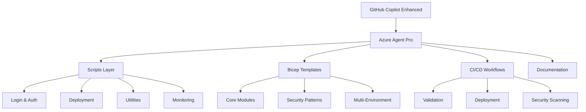

# ☁️ Azure Agent Pro

[](https://github.com/alejandrolmeida/azure-agent-pro/actions/workflows/bicep-validation.yml)
[](https://github.com/alejandrolmeida/azure-agent-pro/actions/workflows/code-quality.yml)
[](https://github.com/alejandrolmeida/azure-agent-pro/actions/workflows/deploy-azure.yml)
[](https://opensource.org/licenses/MIT)
[](https://docs.microsoft.com/en-us/cli/azure/)
[](https://docs.microsoft.com/en-us/azure/azure-resource-manager/bicep/)
[](https://github.com/features/copilot)
[](#)
[](#)
[](CONTRIBUTING.md)

```
                                                          _     _____           
     /\                             /\                   | |   |  __ \          
    /  \    _____   _ _ __ ___     /  \   __ _  ___ _ __ | |_  | |__) | __ ___  
   / /\ \  |_  / | | | '__/ _ \   / /\ \ / _` |/ _ \ '_ \| __| |  ___/ '__/ _ \ 
  / ____ \  / /| |_| | | |  __/  / ____ \ (_| |  __/ | | | |_  | |   | | | (_) |
 /_/    \_\/___|\__,_|_|  \___| /_/    \_\__, |\___|_| |_|\__| |_|   |_|  \___/ 
                                          __/ |                                 
                                         |___/                                  
```

> **Proyecto Educativo de Vanguardia**: Aprende a construir infraestructura Azure enterprise usando **Vibe Coding** con el agente personalizado **Azure_Architect_Pro**, potenciado por 6 MCP Servers especializados. Sin escribir código manualmente. Sin memorizar sintaxis.

## 🎯 Propósito del Proyecto

**Azure Agent Pro** es un proyecto educativo que te enseña el **futuro del desarrollo cloud**: describir lo que necesitas en lenguaje natural y que un agente de IA especializado diseñe, implemente y despliegue infraestructura Azure siguiendo las mejores prácticas. No es Copilot estándar, es **Azure_Architect_Pro**: un agente con miles de líneas de instrucciones especializadas en Azure Well-Architected Framework, FinOps, seguridad y DevOps.

### 🔌 ¿Qué son los MCP Servers?

Los **Model Context Protocol (MCP) Servers** son herramientas especializadas que le dan superpoderes a GitHub Copilot. Azure Agent Pro usa **6 MCP Servers**:

1. **azure-mcp** - Acceso directo a recursos Azure (VNets, NSGs, Key Vaults...)
2. **bicep-mcp** - Validación y generación de Bicep siguiendo best practices
3. **github-mcp** - Gestión de repos, issues, PRs y workflows
4. **filesystem-mcp** - Navegación inteligente del código del proyecto
5. **brave-search-mcp** - Búsqueda de documentación oficial y comunidad
6. **memory-mcp** - Contexto persistente entre sesiones

Es como tener un equipo de especialistas trabajando para ti.

### 🎓 ¿Qué Aprenderás?

- **🗣️ Vibe Coding**: Comunicarte estratégicamente con agentes IA para infraestructura
- **🤖 Azure_Architect_Pro**: Usar un agente personalizado que actúa como arquitecto senior
- **🏗️ Well-Architected**: Diseñar arquitecturas siguiendo los 5 pilares de Azure
- **💰 FinOps**: Análisis de costos ANTES de desplegar (no después)
- **🔧 Bicep IaC**: Generar código modular sin escribir manualmente
- **🚀 DevOps**: CI/CD con GitHub Actions y OIDC (secretless)
- **🔒 Zero Trust**: Security by design con Private Endpoints y Managed Identities
- **📊 Observability**: Application Insights, KQL queries, dashboards automáticos

### 👥 ¿Para Quién es Este Proyecto?

**Ideal para:**
- 👨‍💻 **Desarrolladores** que quieren aprender Azure sin memorizar sintaxis
- 🏢 **IT Admins** que necesitan automatizar infraestructura rápidamente
- 🎓 **Estudiantes** buscando proyectos prácticos para su portfolio
- 🚀 **Cloud Architects** explorando IA en Infrastructure as Code
- 💼 **Equipos enterprise** adoptando Vibe Coding en sus workflows

**NO necesitas:**
- ❌ Ser experto en Azure
- ❌ Saber Bicep de memoria
- ❌ Conocer comandos Azure CLI
- ❌ Experiencia previa con IaC

**Solo necesitas:**
- ✅ Curiosidad y ganas de aprender
- ✅ GitHub Copilot (Individual, Business o Enterprise)
- ✅ Azure subscription (free trial funciona)
- ✅ VS Code instalado

## 🏗️ Arquitectura del Proyecto

Azure Agent Pro está estructurado en capas para maximizar la reutilización y facilitar el aprendizaje:



## 📁 Estructura del Proyecto

```
azure-agent-pro/
├── 🤖 .github/
│   ├── chatmodes/                  # GitHub Copilot enhanced configurations
│   │   ├── azure-infrastructure-agent.md
│   │   ├── azure-devops-pipeline-agent.md
│   │   └── azure-security-agent.md
│   ├── workflows/                  # CI/CD Automation
│   │   ├── bicep-validation.yml    # Infrastructure validation
│   │   ├── deploy-azure.yml        # Multi-environment deployment
│   │   └── code-quality.yml        # Security & quality checks
│   ├── ISSUE_TEMPLATE/            # Structured issue templates
│   └── CODEOWNERS                 # Automated code review assignments
├── 🛠️ scripts/
│   ├── login/
│   │   └── azure-login.sh          # Enhanced authentication with MCP
│   ├── deploy/
│   │   └── bicep-deploy.sh         # Professional deployment automation
│   ├── config/
│   │   └── azure-config.sh         # Enterprise configuration management
│   ├── utils/
│   │   ├── azure-utils.sh          # Advanced Azure CLI utilities
│   │   └── bicep-utils.sh          # Bicep development helpers
│   ├── setup/
│   │   └── mcp-setup.sh            # Model Context Protocol integration
│   └── monitoring/
│       └── azure-monitor.sh        # Infrastructure monitoring
├── ☁️ bicep/
│   ├── main.bicep                  # Main infrastructure template
│   ├── modules/                    # Reusable infrastructure components
│   │   ├── storage-account.bicep   # Secure storage configuration
│   │   ├── virtual-network.bicep   # Network security patterns
│   │   ├── key-vault.bicep         # Secrets management
│   │   ├── app-service.bicep       # Application hosting
│   │   └── monitoring.bicep        # Observability stack
│   └── parameters/                 # Environment-specific configurations
│       ├── dev.parameters.json     # Development environment
│       ├── test.parameters.json    # Testing environment
│       ├── stage.parameters.json   # Staging environment
│       └── prod.parameters.json    # Production environment
├── 📚 docs/                        # Documentación completa
│   ├── README.md                   # 🌟 Índice maestro de documentación
│   ├── getting-started/            # Setup inicial
│   │   └── mcp-quickstart.md       # Configurar MCP Servers (10-15 min)
│   ├── reference/                  # Referencias rápidas
│   │   ├── azure-cli-cheatsheet.md # Comandos Azure CLI (711 líneas)
│   │   ├── bicep-cheatsheet.md     # Sintaxis Bicep (1,165 líneas)
│   │   └── mcp-servers-cheatsheet.md # MCP avanzado (1,059 líneas)
│   └── workshop/                   # 🎓 Workshop principal
│       ├── kitten-space-missions/  # ⭐ Workshop estrella (3,511 líneas)
│       │   ├── 8 actividades progresivas
│       │   └── assets/workshop-hero.png
│       └── archived/               # Contenido histórico
├── 🔧 .vscode/                     # VS Code optimizations
│   ├── settings.json               # Optimized settings for Azure development
│   ├── extensions.json             # Recommended extensions
│   └── bicep.code-snippets         # Custom Bicep snippets
├── 🔧 scripts/                     # Automation scripts
│   ├── deploy/
│   │   └── bicep-deploy.sh         # Deployment automation
│   ├── utils/
│   │   ├── azure-utils.sh          # Azure utilities
│   │   └── bicep-utils.sh          # Bicep utilities
│   ├── setup/
│   │   └── mcp-setup.sh            # MCP servers configuration
│   └── update/
│       └── project-updater.sh      # Project updater
├── 🏗️ bicep/                      # Infrastructure as Code
│   ├── main.bicep                  # Main template
│   ├── modules/                    # Bicep modules
│   │   ├── storage-account.bicep   # Storage Account
│   │   ├── virtual-network.bicep   # Virtual Network
│   │   └── key-vault.bicep         # Key Vault
│   └── parameters/
│       ├── dev.parameters.json     # Development parameters
│       └── prod.parameters.json    # Production parameters
├── 🤖 .github/
│   ├── workflows/                  # CI/CD workflows
│   ├── chatmodes/                  # GitHub Copilot chat modes
│   │   ├── azure-infrastructure-agent.md
│   │   └── azure-devops-pipeline-agent.md
│   └── ISSUE_TEMPLATE/             # Issue templates
├── PROJECT_CONTEXT.md              # Research project context
├── LEARNING_OBJECTIVES.md          # Educational goals and outcomes
└── README.md                       # This file
```

## 🎓 Empezar: Workshop Kitten Space Missions


### 🐱🚀 Construye Infraestructura Azure SIN Escribir Código

**¿Qué es esto?** Un workshop hands-on donde aprendes **Vibe Coding profesional** construyendo una API de misiones espaciales tripuladas por gatitos astronautas. Sí, suena divertido. Pero la infraestructura Azure que generarás es 100% enterprise.

**👉 [Comenzar Workshop →](docs/workshop/kitten-space-missions/)**

---

### 📊 Lo que construirás:

Una **API REST completa** en Azure con:
- ☁️ **~15 recursos Azure** (App Service, SQL Database, Key Vault, VNet, NSG, Application Insights...)
- 🔒 **Zero Trust** architecture (Private Endpoints, Managed Identities, NSGs)
- 🚀 **CI/CD** completo con GitHub Actions y OIDC
- 📊 **Observabilidad** enterprise (dashboards, alerts, KQL queries)
- 💰 **FinOps** con análisis de costos antes de desplegar

**Todo generado automáticamente por Azure_Architect_Pro**. Tú solo describes lo que necesitas.

---

### 🎯 Lo que aprenderás:

| Habilidad | Qué dominarás |
|-----------|---------------|
| 🗣️ **Vibe Coding** | Comunicarte estratégicamente con agentes IA |
| 🏗️ **Well-Architected** | Diseñar arquitecturas siguiendo los 5 pilares de Azure |
| 💰 **FinOps** | Análisis de costos con informes HTML profesionales |
| 🔧 **Bicep IaC** | Generar código modular sin escribir manualmente |
| 🚀 **DevOps** | CI/CD con GitHub Actions, OIDC, multi-stage deployments |
| 🔒 **Security** | Private Endpoints, Managed Identities, Zero Trust |
| 📊 **Observability** | Application Insights, KQL, dashboards, alertas |
| ✅ **Testing** | Smoke tests, security validation, health checks |

---

### 📚 8 Actividades Progresivas (3-4 horas):

1. **[Setup](docs/workshop/kitten-space-missions/activity-01-setup.md)** - Fork, clonar, configurar MCP Servers (30 min)
2. **[Primera Conversación](docs/workshop/kitten-space-missions/activity-02-first-conversation.md)** - Diseñar arquitectura con el agente (30 min)
3. **[Análisis FinOps](docs/workshop/kitten-space-missions/activity-03-finops-analysis.md)** - Informe HTML de costos antes de desplegar (30 min)
4. **[Generación Bicep](docs/workshop/kitten-space-missions/activity-04-bicep-generation.md)** - Módulos IaC automáticos (45 min)
5. **[CI/CD Setup](docs/workshop/kitten-space-missions/activity-05-cicd-setup.md)** - GitHub Actions + OIDC (30 min)
6. **[Deployment](docs/workshop/kitten-space-missions/activity-06-azure-deployment.md)** - Desplegar en Azure real (45 min)
7. **[Monitoreo](docs/workshop/kitten-space-missions/activity-07-monitoring.md)** - Application Insights (20 min)
8. **[Testing](docs/workshop/kitten-space-missions/activity-08-testing.md)** - Validación final (20 min)

**💡 Cada actividad incluye:** Objetivos, pasos detallados, troubleshooting, y entregables verificables.

---

### 🎁 ¿Por qué este workshop es diferente?

| Otros Tutorials | Este Workshop |
|----------------|---------------|
| "Copia este código Bicep" | "Describe lo que necesitas, el agente lo genera" |
| Sintaxis y comandos | Estrategia y comunicación con IA |
| Un recurso aislado | Arquitectura enterprise completa |
| Deploy y reza | FinOps ANTES + validación DURANTE |
| Tema aburrido | Gatitos astronautas 🐱🚀 (memorable!) |

**No aprenderás sintaxis de Bicep. Aprenderás a PENSAR como arquitecto y COMUNICARTE con IA.**

---

### 🚀 Requisitos Mínimos:

- ✅ Cuenta GitHub (para fork del repo)
- ✅ GitHub Copilot activo (Individual, Business o Enterprise)
- ✅ Azure subscription (free trial con $200 funciona)
- ✅ VS Code instalado
- ✅ Linux, macOS o WSL2 en Windows

**Costo estimado infraestructura:** ~$40-50/mes en dev (puedes eliminar todo al terminar)

---

### 📖 Documentación Completa:

**[📚 Ver Documentación →](docs/README.md)**

Incluye:
- ⚙️ [Setup MCP Servers](docs/getting-started/mcp-quickstart.md) - 10-15 minutos
- 📖 [Azure CLI Cheatsheet](docs/reference/azure-cli-cheatsheet.md) - 711 líneas
- 📗 [Bicep Cheatsheet](docs/reference/bicep-cheatsheet.md) - 1,165 líneas
- 📙 [MCP Servers Cheatsheet](docs/reference/mcp-servers-cheatsheet.md) - 1,059 líneas

**Total: 10,368 líneas de documentación curada**

---

## 🚀 Inicio Rápido

### 1. Configuración Inicial

Ejecuta el script de login para autenticarte con Azure:

```bash
cd scripts/login
./azure-login.sh
```

Este script:
- Verifica que Azure CLI esté instalado
- Realiza el login a Azure
- Te permite seleccionar la suscripción
- Guarda la configuración en `config/azure-config.env`

### 2. Verificar Configuración

```bash
cd scripts/config
./azure-config.sh
```

### 3. Desplegar Plantillas Bicep

```bash
cd scripts/deploy

# Validar una plantilla
./bicep-deploy.sh validate ../../bicep/main.bicep

# Desplegar la plantilla principal
./bicep-deploy.sh deploy ../../bicep/main.bicep my-resource-group my-deployment ../../bicep/parameters/dev.parameters.json
```

## 📋 Scripts Disponibles

### `scripts/common/azure-login.sh`

Script principal para autenticación con Azure CLI.

**Opciones:**
- Sin parámetros: Login completo y configuración
- `-s, --subscription`: Solo seleccionar suscripción
- `-i, --info`: Mostrar información de la cuenta
- `-c, --config`: Solo guardar configuración
- `-h, --help`: Mostrar ayuda

**Ejemplos:**
```bash
./azure-login.sh                    # Login completo
./azure-login.sh -s                 # Solo cambiar suscripción
./azure-login.sh -i                 # Mostrar información actual
```

### `scripts/common/azure-config.sh`

Gestión de configuración y variables de entorno.

**Opciones:**
- Sin parámetros: Cargar y validar configuración
- `-l, --locations`: Listar ubicaciones disponibles
- `-s, --status`: Mostrar estado actual
- `-v, --validate`: Validar configuración
- `--set-location <ubicacion>`: Establecer ubicación por defecto

**Ejemplos:**
```bash
./azure-config.sh                   # Cargar configuración
./azure-config.sh -l                # Listar ubicaciones
./azure-config.sh --set-location westeurope
```

### `scripts/agents/architect/bicep-deploy.sh`

Deployment y gestión de plantillas Bicep.

**Comandos:**
- `validate <template> [parameters]`: Validar plantilla
- `deploy <template> <rg> [name] [params] [mode]`: Realizar deployment
- `list [resource-group]`: Listar deployments
- `delete <resource-group> <name>`: Eliminar deployment
- `gen-params <template> [output]`: Generar plantilla de parámetros

**Ejemplos:**
```bash
./bicep-deploy.sh validate ../../bicep/templates/storage-account.bicep
./bicep-deploy.sh deploy ../../bicep/main.bicep my-rg storage-deploy ../../bicep/parameters/dev.parameters.json
./bicep-deploy.sh list my-rg
```

## 🏗️ Plantillas Bicep

### Plantilla Principal (`bicep/main.bicep`)

Plantilla que orquesta múltiples recursos:
- Storage Account
- Virtual Network con subredes
- Key Vault

### Plantillas Disponibles

1. **Storage Account** (`bicep/templates/storage-account.bicep`)
   - Configuración segura por defecto
   - Soporte para diferentes SKUs
   - Contenedor por defecto

2. **Virtual Network** (`bicep/templates/virtual-network.bicep`)
   - Múltiples subredes configurables
   - Network Security Groups automáticos
   - Route Tables opcionales

3. **Key Vault** (`bicep/modules/key-vault.bicep`)
   - Configuración de seguridad avanzada
   - Soft delete habilitado
   - Logging de auditoría

### Archivos de Parámetros

- `bicep/parameters/dev.parameters.json`: Configuración para desarrollo
- `bicep/parameters/prod.parameters.json`: Configuración para producción

## 🔧 Configuración

### Variables de Entorno

El archivo `config/azure-config.env` contiene:

```bash
export AZURE_SUBSCRIPTION_ID="..."
export AZURE_SUBSCRIPTION_NAME="..."
export AZURE_TENANT_ID="..."
export AZURE_USER="..."
export AZURE_LOCATION="eastus"
export AZURE_RESOURCE_GROUP_PREFIX="rg"
export AZURE_TAG_ENVIRONMENT="dev"
export AZURE_TAG_PROJECT="azure-agent"
```

Para cargar las variables:
```bash
source config/azure-config.env
```

## 📚 Recursos Adicionales

### Documentación de Azure

- [Azure CLI Documentation](https://docs.microsoft.com/en-us/cli/azure/)
- [Bicep Documentation](https://docs.microsoft.com/en-us/azure/azure-resource-manager/bicep/)
- [Azure Resource Manager](https://docs.microsoft.com/en-us/azure/azure-resource-manager/)

### Mejores Prácticas

1. **Seguridad**
   - Usa Key Vault para secretos
   - Habilita Network Security Groups
   - Configura políticas de acceso restrictivas

2. **Naming Conventions**
   - Usa prefijos consistentes
   - Incluye el entorno en el nombre
   - Mantén nombres únicos globalmente

3. **Tagging**
   - Etiqueta todos los recursos
   - Incluye información de costo y propiedad
   - Usa tags para automatización

## 🐛 Solución de Problemas

### Error: Azure CLI no encontrado
```bash
# Instalar Azure CLI en Ubuntu/Debian
curl -sL https://aka.ms/InstallAzureCLIDeb | sudo bash

# Instalar en macOS
brew install azure-cli
```

### Error: Bicep CLI no encontrado
```bash
az bicep install
```

### Error: Permisos insuficientes
Verifica que tu cuenta tenga los permisos necesarios:
- Contributor o Owner en la suscripción
- User Access Administrator para Key Vault

## 🚀 GitHub Integration y CI/CD

Este proyecto está completamente optimizado para GitHub con workflows automatizados y mejores prácticas de DevOps.

### 🔄 Workflows Automatizados

#### Bicep Validation (`bicep-validation.yml`)
- ✅ **Trigger**: Push/PR a `main` y `develop` con cambios en `bicep/`
- 🔍 **Validaciones**: Linting, sintaxis, what-if analysis, security checks
- � **Testing**: Deploy automático a ambiente de testing en PRs
- 📦 **Artifacts**: Templates compilados disponibles por 30 días

#### Deploy to Azure (`deploy-azure.yml`)
- ✅ **Trigger**: Push a `main` (auto-deploy dev) y workflow manual
- 🌍 **Ambientes**: dev, test, stage, prod con protecciones específicas
- 🔒 **Seguridad**: OIDC authentication, confirmación requerida para prod
- 📊 **Monitoring**: Outputs de deployment y tagging automático

#### Code Quality (`code-quality.yml`)
- ✅ **Trigger**: Push/PR + schedule semanal
- 🛡️ **Security**: Trivy scanning, credential detection, Bicep security
- 📝 **Quality**: ShellCheck, Markdown linting, dependency review
- 🔍 **Analysis**: SARIF upload para GitHub Security tab

### 🛡️ Branch Protection

La rama `main` está protegida con:
- ✅ **Required reviews**: 1 aprobación mínima
- ✅ **Status checks**: Todos los workflows deben pasar
- ✅ **CODEOWNERS**: Reviews automáticos por área de expertise
- ❌ **Force push**: Deshabilitado
- ❌ **Delete branch**: Deshabilitado

### 🎯 GitHub Features Habilitadas

- 🔒 **Security**: Dependency graph, Dependabot, secret scanning
- 📊 **Insights**: Code frequency, contributor stats, traffic analytics
- 🏷️ **Labels**: Sistema organizado para issues y PRs
- 📝 **Templates**: Issues específicos (bug, feature, docs, azure)
- 📋 **Project boards**: Para tracking de roadmap y sprints

### �🤝 Contribución con GitHub

¡Las contribuciones son bienvenidas! Por favor lee nuestra [guía de contribución](CONTRIBUTING.md).

#### Quick Start para Contributors

1. **Fork y clone**
   ```bash
   git clone https://github.com/tu-usuario/azure-agent.git
   cd azure-agent
   ```

2. **Configurar upstream**
   ```bash
   git remote add upstream https://github.com/alejandrolmeida/azure-agent.git
   ```

3. **Crear feature branch**
   ```bash
   git checkout -b feature/mi-mejora
   ```

4. **Hacer cambios y push**
   ```bash
   git add .
   git commit -m "feat: descripción del cambio"
   git push origin feature/mi-mejora
   ```

5. **Crear Pull Request** usando la plantilla automática

#### Tipos de Contribuciones

- 🐛 **Bug fixes**: Usa template de bug report
- ✨ **Features**: Usa template de feature request  
- 📚 **Docs**: Usa template de documentation
- 🔧 **Azure/Bicep**: Usa template específico de Azure
- 🔒 **Security**: Revisa nuestra [política de seguridad](SECURITY.md)

### 📈 GitHub Actions Secrets

Para contribuir con workflows, necesitarás configurar estos secrets:

```bash
# Required for Azure deployments
AZURE_CLIENT_ID         # Service Principal ID para OIDC
AZURE_TENANT_ID          # Azure AD Tenant ID
AZURE_SUBSCRIPTION_ID    # Target subscription ID

# Optional for notifications
SLACK_WEBHOOK_URL        # Para notificaciones de deployment
TEAMS_WEBHOOK_URL        # Para notificaciones de deployment
```

## 🤝 Contribución

¡Las contribuciones son bienvenidas! Por favor sigue estos pasos:

1. Lee nuestra [guía de contribución](CONTRIBUTING.md) 📚
2. Revisa los [issues abiertos](https://github.com/alejandrolmeida/azure-agent/issues) 🔍
3. Fork el proyecto 🍴
4. Crea una rama para tu feature (`git checkout -b feature/AmazingFeature`)
5. Commit tus cambios (`git commit -m 'feat: Add some AmazingFeature'`)
6. Push a la rama (`git push origin feature/AmazingFeature`)
7. Abre un Pull Request usando la plantilla 📝

### 🏷️ Convenciones de Commits

Usamos [Conventional Commits](https://www.conventionalcommits.org/):
- `feat:` Nueva funcionalidad
- `fix:` Corrección de bug  
- `docs:` Cambios en documentación
- `style:` Cambios de formato
- `refactor:` Refactoring de código
- `test:` Añadir o corregir tests
- `chore:` Tareas de mantenimiento

## � Releases

Ver [CHANGELOG.md](CHANGELOG.md) para el historial completo de cambios.

**Latest Release**: [v1.1.0](https://github.com/Alejandrolmeida/azure-agent-pro/releases/tag/v1.1.0) - Azure SQL DBA Agent & Infrastructure Reorganization

## �📄 Licencia

Este proyecto está bajo la Licencia MIT. Ver el archivo `LICENSE` para más detalles.

## 👥 Autores

- **Alejandro Almeida** ([@Alejandrolmeida](https://github.com/Alejandrolmeida)) - Creador y desarrollador principal

## 🙏 Agradecimientos

- Documentación oficial de Azure
- Comunidad de Azure Bicep
- Ejemplos de Microsoft Azure